# Diagrams

The visual companion to [Architecture.md](Architecture.md): the project graph, class
diagrams, every data-flow pipeline, and the sandbox / container-isolation flow per OS —
all in [Mermaid](https://mermaid.js.org/) (GitHub renders these natively). This file is
the single source of truth for diagrams; the prose docs link here.

Sandbox state reflected below (current code): filesystem + network are **enforced on
Linux (Landlock) and macOS (Seatbelt)**; **Windows is NoOp** (an unwired, experimental
AppContainer backend exists — see [Windows-Sandbox-Resume.md](Windows-Sandbox-Resume.md)).

## Table of contents

- [System architecture](#system-architecture)
- [CLI command routing](#cli-command-routing)
- [Class diagram — Core / patching](#class-diagram--core--patching)
- [Class diagram — PackageManager](#class-diagram--packagemanager)
- [Class diagram — Sandbox](#class-diagram--sandbox)
- [Pipelines](#pipelines) — Build, Client Patch, Rollback, Cleanup, Install, Update, Uninstall, Run, Permissions
- [Sandbox / container isolation per OS](#sandbox--container-isolation-per-os)

---

## System architecture

The five shipped projects plus two test projects and their references. `Hina.CLI`
references both `Hina.PackageManager` (top-level commands) and `Hina.Core` directly
(the `hina dev` patcher subcommands). `Hina.PackageManager` reuses
`Hina.Core.PatchClient` for delta downloads — there is no parallel engine.

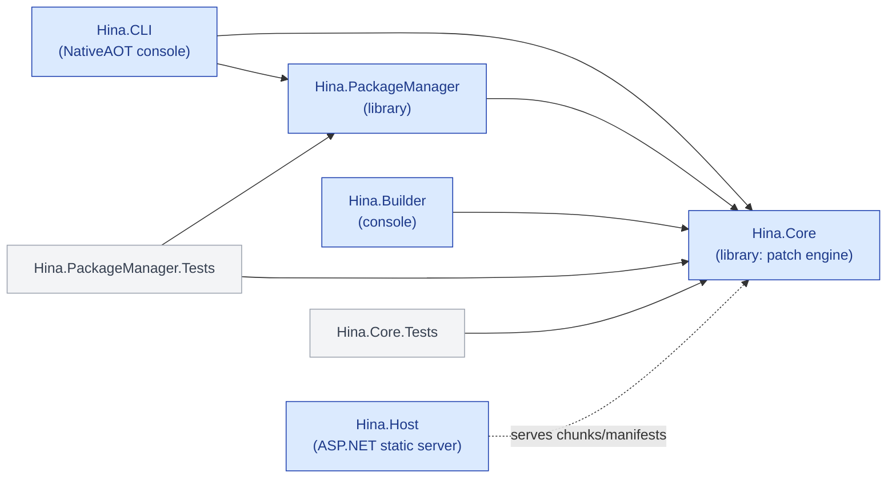

---

## CLI command routing

`Program.Main` parses global flags (`--verbose`, `--version`, `help`) then hands off to
`CommandRouter`, which dispatches on the first arg to a command that calls into a
`Hina.PackageManager` service (or `Hina.Core` for `hina dev`). Source:
`Hina.CLI/Program.cs`, `Hina.CLI/CommandRouter.cs`, `Hina.CLI/Commands/*`.

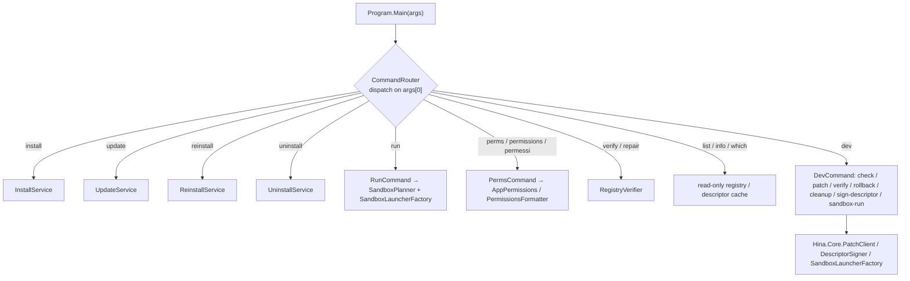

---

## Class diagram — Core / patching

The patch engine in `Hina.Core`. `PatchClient` implements `IPatchClient`, drives an
`IChunker` + `IHasher`, fetches via `HttpChunkClient` (with `RetryPolicy`), and journals
backups in `PatchJournal`. `ManifestSigner` signs/verifies the `Manifest` tree.

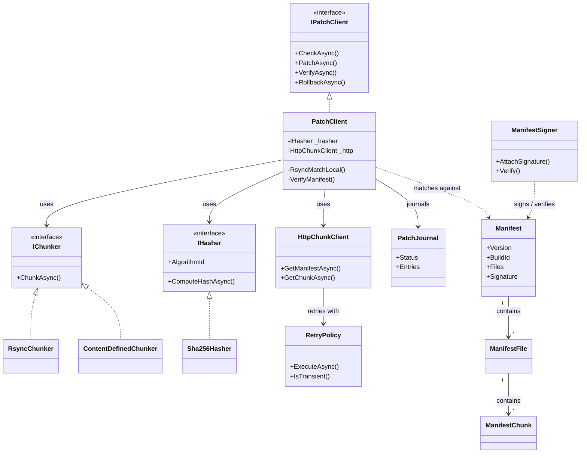

---

## Class diagram — PackageManager

The package-manager layer. The install/update/uninstall/reinstall services orchestrate
`DescriptorFetcher`/`Validator`/`Signer`, the `RegistryStore`, the `HookExecutor`, and
the per-OS `IPlatformIntegration`; `InstallTransaction` journals side-effects for
rollback. The services reuse `Hina.Core.PatchClient` for the actual file delta.

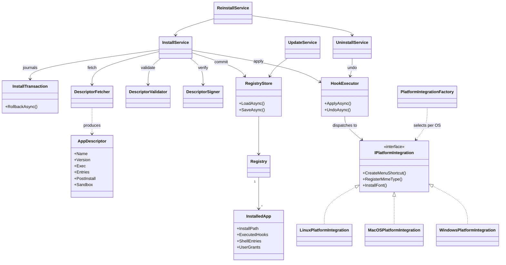

---

## Class diagram — Sandbox

The sandbox subsystem mirrors `Platform/`: a per-OS `ISandboxLauncher` chosen by
`SandboxLauncherFactory`. `SandboxPlanner` folds the descriptor scope + user grants into
a `SandboxPlan` (resolving abstract `SandboxTokens` to absolute paths via `SandboxEnv` /
`SandboxPaths`). `AppPermissions` / `PermissionsFormatter` drive `hina perms`;
`SandboxDiff` drives the update-consent gate.

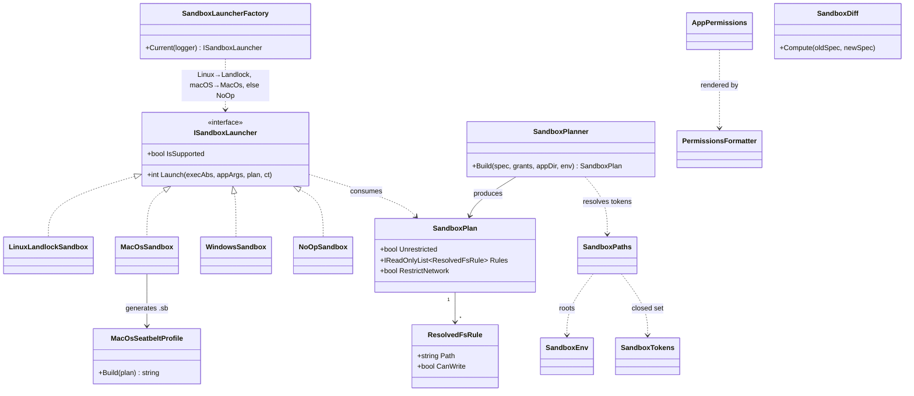

---

## Pipelines

Faithful flowchart versions of the nine data-flow pipelines described in prose in
[Architecture.md](Architecture.md). Step numbers match the prose.

### Build pipeline (`Hina.Builder`)

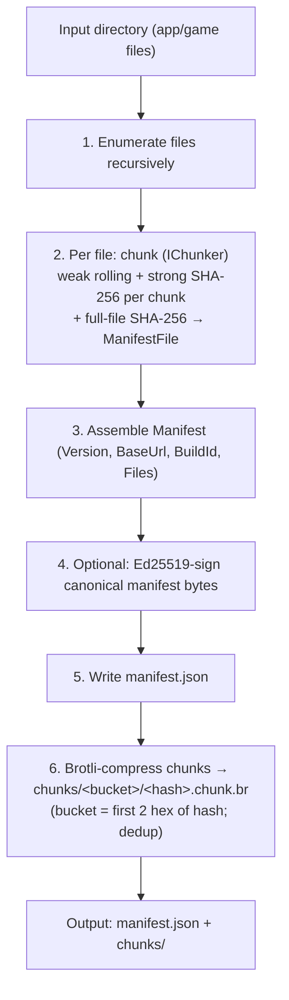

### Client patch pipeline (`PatchClient`)

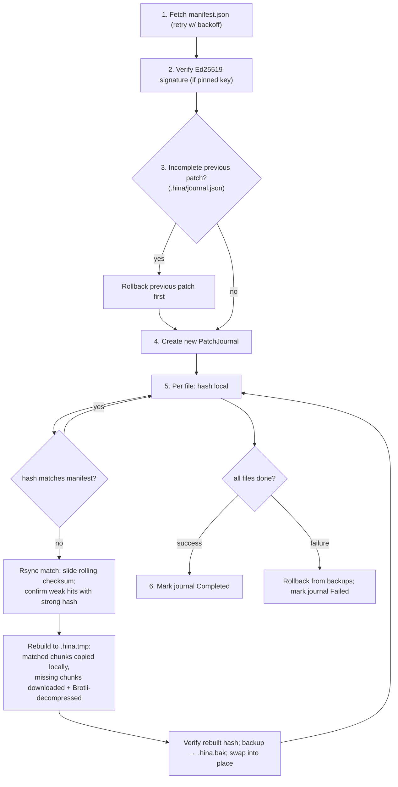

### Rollback flow

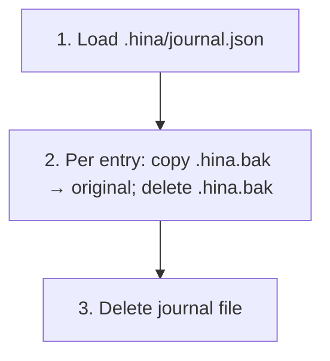

### Cleanup flow

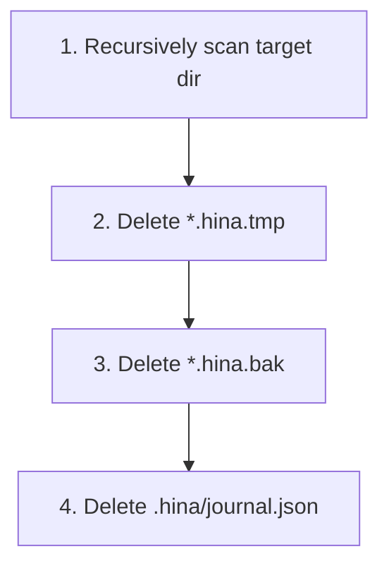

### Install flow (`InstallService`)

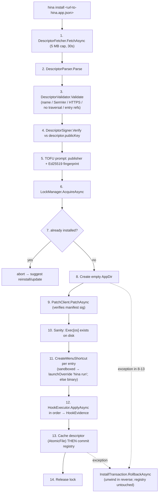

### Update flow (`UpdateService`)

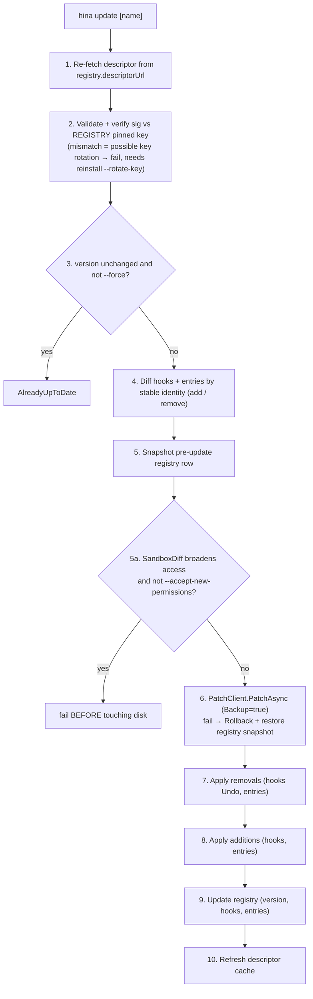

### Uninstall flow (`UninstallService`)

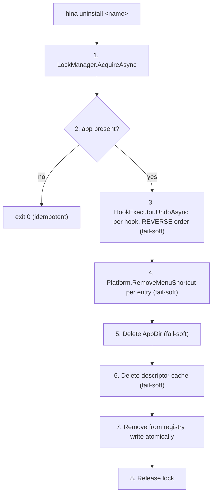

> Hook side-effects are read from the **registry**, never the live descriptor (a newer
> descriptor might list different hooks).

### Run flow (`RunCommand` — the launch chokepoint)

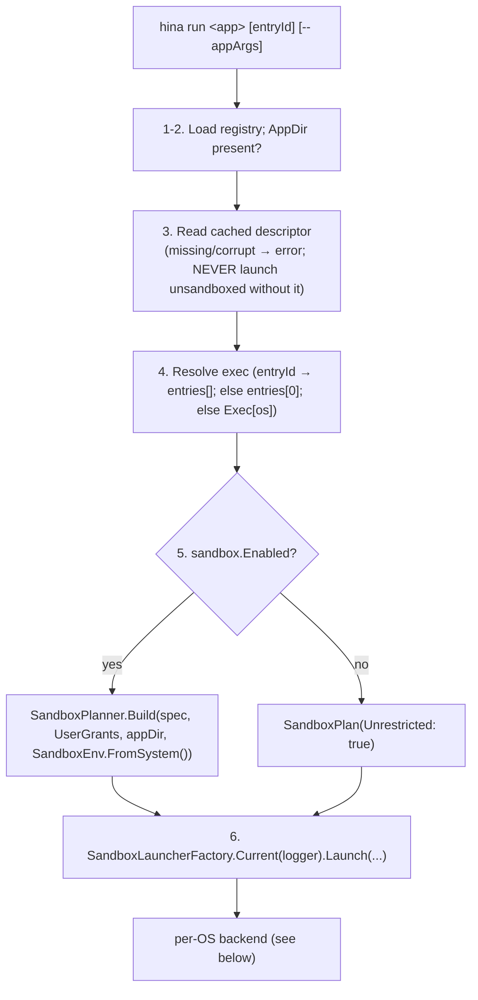

### Permissions flow (`hina perms` / `verify`)

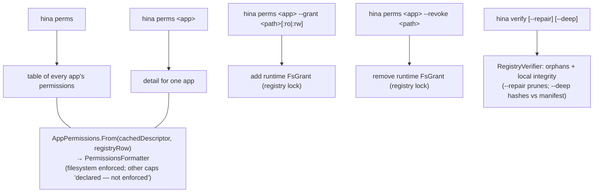

---

## Sandbox / container isolation per OS

How a sandboxed app launches and gets isolated. The shell shortcut runs
`hina run <app> <entry>` instead of the binary, so Hina builds the plan and installs
the sandbox **before** the app starts.

### Master launch + isolate flow

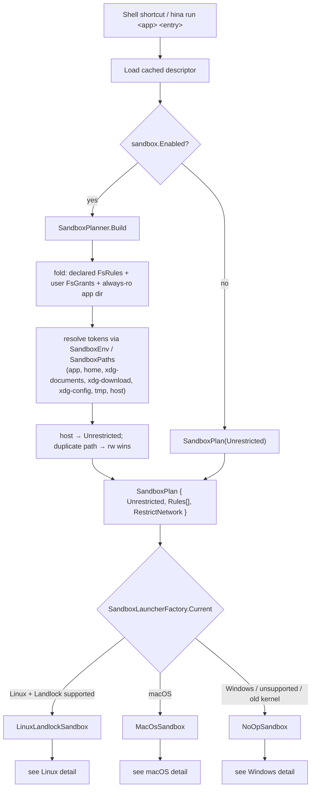

### Linux — Landlock (enforced)

Applies the ruleset to `hina` itself, then `execv`s the app, which inherits the
restrictions — the sandboxed app's PID **is** hina's. Any failure warns and execs
unsandboxed; it never blocks a launch.

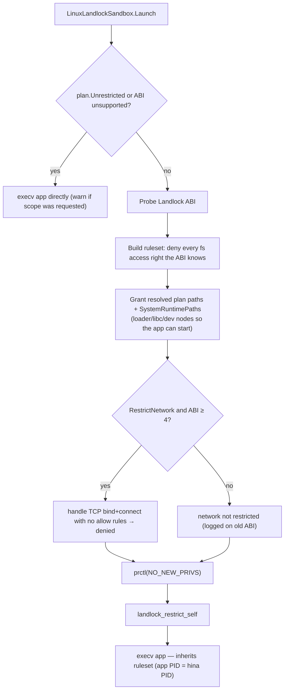

### macOS — Seatbelt / sandbox-exec (enforced)

Generates a Seatbelt profile from the plan and launches the app as a **child** under
`sandbox-exec -f`, so the temp profile can be cleaned up after exit.

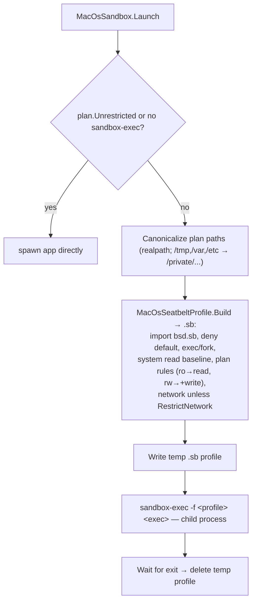

### Windows — NoOp today (AppContainer scaffold, unwired)

The factory returns `NoOpSandbox` on Windows: the app runs unsandboxed with a one-time
warning. The `WindowsSandbox` AppContainer backend exists but is **not selected** — its
lowbox honored no runtime grant on CI (full investigation in
[Windows-Sandbox-Resume.md](Windows-Sandbox-Resume.md)).

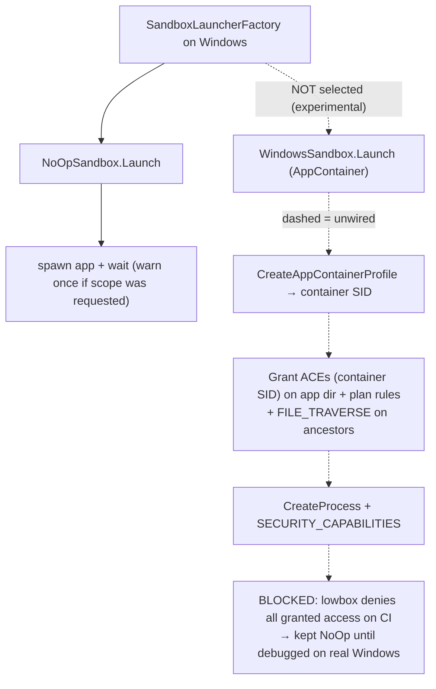

### Shortcut routing per OS

How the install-time shortcut is wired so launches route through `hina run` (and thus
the sandbox) on the enforcing OSes.

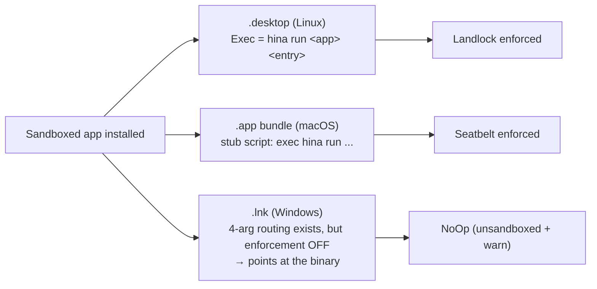

### Sequence — one sandboxed launch

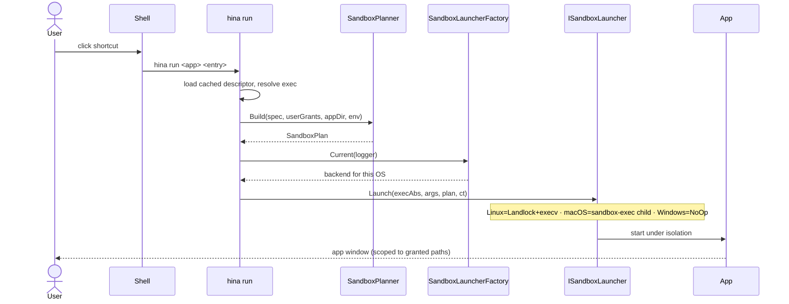
