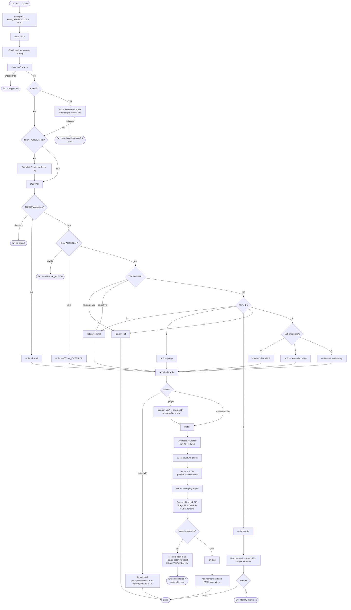

# Install Script

`scripts/install.sh` (Linux + macOS) and `scripts/install.ps1` (Windows) are
the one-liner installers behind:

```sh
curl -fsSL https://raw.githubusercontent.com/Arutosio/Hina/master/scripts/install.sh | bash
```

```powershell
iwr -useb https://raw.githubusercontent.com/Arutosio/Hina/master/scripts/install.ps1 | iex
```

They detect platform + arch, download the matching release archive from
GitHub, verify it cryptographically, and install `hina` via an atomic
rename — surviving power loss, network drop-outs, partial downloads, and
re-runs on an existing installation.

The PowerShell installer mirrors the same behaviour on Windows. Everything
below describes both unless explicitly noted.

---

## What it can do

- **Fresh install.** Download + extract + place `hina` on PATH.
- **Detect an existing install** and present a 5-option menu.
- **Reinstall** the binary, keeping installed apps and the registry.
- **Clean reinstall** that wipes the registry, installed apps, and pinned
  publisher keys, then installs fresh. Requires typed `yes` confirmation.
- **Integrity check**: re-download the release, verify its SHA-256, and
  compare the released binary's hash against the installed one. No
  filesystem changes.
- **Uninstall** in three granularities:
  - **Full** — hina binary + all installed apps + configs. Side-effects
    (desktop entries, Start Menu shortcuts, `.cmd` shims, fonts, HKCU
    MIME entries) are cleaned by running `hina uninstall <name>` per app
    before tearing down the registry.
  - **Configs** — hina binary + configs (registry, descriptors, pinned
    keys). App binaries are preserved on disk as orphan files.
  - **Binary only** — just the `hina` binary. Apps + configs survive;
    reinstalling later resumes the previous state.
- **Pin a specific version** via `HINA_VERSION`. Auto-prefixes `v` if
  user passes a bare semver (`1.2.3` → `v1.2.3`).
- **Override the install directory** via `HINA_INSTALL_DIR`.
- **Bypass the menu non-interactively** via `HINA_ACTION` (for CI).
- **Skip rc-file editing** via `HINA_NO_MODIFY_PATH=1`.

## What it deliberately does NOT do

- No `sudo`. Everything is user-scope: `~/.local/bin/hina` (Unix),
  `%LOCALAPPDATA%\Hina\bin\hina.exe` (Windows).
- No GPG/minisign signature verification (only SHA-256 — checksum hosted
  alongside the archive on the same GitHub release).
- No automatic clean-reinstall or uninstall. Destructive paths always
  require a typed `yes` (interactive) or a second env-var gate
  (`HINA_PURGE_YES=1`, `HINA_UNINSTALL_YES=1`).

---

## How it works

### Hardening guarantees

1. **Power-loss safe.** Downloads land in `<archive>.partial`, renamed to
   the final name only after curl exits 0. The installed binary is staged
   at `.hina.new.$$`, then placed live via POSIX `rename(2)` (atomic on
   the same filesystem; NTFS rename on Windows). If the new binary fails
   its `--help` smoke test, the previous binary is restored from the
   `.hina.bak.$$` backup.
2. **Network-drop safe.** `curl --retry 5 -C -` resumes interrupted
   downloads from the existing partial file. After 5 failed attempts the
   script aborts with a clear message.
3. **Corruption-safe.** The release publishes a `.sha256` companion file
   for every archive. The installer downloads it alongside the archive
   and refuses to extract on mismatch. If the `.sha256` is missing
   (older releases), it warns and falls back to a structural
   `tar tzf` / zip integrity check.
4. **Concurrency-safe.** A lock directory at `$DEST/.hina-install.lock`
   (created via atomic `mkdir`) prevents two installers from racing. If
   a previous lock is stale (PID dead), the second installer overrides
   it; if alive, it aborts with the offending PID.
5. **Symlink-safe.** Backup uses `cp -Pp` so a symlinked `$DEST/hina` is
   preserved as a symlink in the rollback path.
6. **TTY-safe.** Interactive prompts read from `/dev/tty` (not stdin,
   which is consumed by `curl | bash`). A real open-test guards against
   no-controlling-terminal contexts where `[ -r /dev/tty ]` would
   falsely report success.
7. **Script-truncation safe.** The whole script body is wrapped in a
   `main()` function called at the very end. If the network drops mid-
   download of the script itself, bash fails to parse and refuses to
   execute partial logic.

### Runtime dependencies

The `hina` binary is NativeAOT-compiled and **does not** require a .NET
runtime on the user's machine — the runtime is statically linked into
the binary. There is one platform caveat:

| OS | Runtime libs the binary links against | Installer behaviour |
|----|---------------------------------------|---------------------|
| Linux | `libssl.so.3`, `libbrotli*`, glibc ≥ 2.31 (typical default on modern distros) | Trusts the distro defaults; if a lib is missing the smoke-test failure includes a hint pointing to the right package |
| macOS | Homebrew `openssl@3` + `brotli` (linked at build time against `/opt/homebrew` on arm64, `/usr/local` on x64) | **Pre-checked before download**. Missing libs abort with `brew install openssl@3 brotli` instruction |
| Windows | Universal C Runtime (UCRT) + Win32 system DLLs — always present on Windows 10+ | Smoke-test failure produces a hint on missing-DLL or architecture-mismatch errors |

On macOS, the installer aborts up front if Homebrew is missing or
either `openssl@3` or `brotli` is not installed at the expected prefix.
This avoids the dyld error happening later at first run.

On Linux + Windows the smoke test catches missing-library errors and
the error message points to the likely fix (distro package name on
Linux, UCRT / arch mismatch on Windows). Common cases the hint covers:

- `dyld: Library not loaded` → `brew install openssl@3 brotli`
- `libssl`/`libcrypto` not found → install distro libssl3 / openssl
- `libbrotli` not found → install distro libbrotli / `brew install brotli`
- `GLIBC_X.Y not found` → glibc too old, use a newer distro
- Windows `0xC000007B` / "not a valid Win32 application" → arch mismatch

### Platform layout

| OS | Binary | Registry / configs |
|----|--------|---------------------|
| Linux | `~/.local/bin/hina` | `${XDG_DATA_HOME:-~/.local/share}/hina/` |
| macOS | `~/.local/bin/hina` | `~/Library/Application Support/Hina/` |
| Windows | `%LOCALAPPDATA%\Hina\bin\hina.exe` | `%LOCALAPPDATA%\Hina\` |

The registry directory holds `registry.json` (installed-apps metadata +
pinned publisher keys), `Apps/<name>/` (per-app install directories),
and `descriptors/<name>.json` (cached `hina.app.json` files).

### PATH integration

On Unix the script appends a marker-delimited block to your shell rc
file (idempotent via `# >>> hina installer >>>` / `# <<< hina installer
<<<` markers). The shell-rc target is picked from `$SHELL` — `.zshrc`,
`.bash_profile` (macOS), `.bashrc` (Linux), `.config/fish/config.fish`,
or `.profile` as the final fallback.

On Windows the script prepends `$Dest` to the user-scope `Path` env var
via `[Environment]::SetEnvironmentVariable('Path', ..., 'User')` and
updates `$env:Path` in the current process so `hina` is immediately
callable in the same shell.

The full-uninstall and configs-uninstall modes remove these PATH
entries on the way out. The binary-only uninstall leaves them alone so
a future reinstall resumes seamlessly.

---

## Environment overrides

| Variable | Effect | Default |
|----------|--------|---------|
| `HINA_VERSION` | Pin a release tag. Bare semver auto-prefixed with `v`. | latest release |
| `HINA_INSTALL_DIR` | Override destination directory. | `~/.local/bin` (Unix) / `%LOCALAPPDATA%\Hina\bin` (Windows) |
| `HINA_NO_MODIFY_PATH=1` | Skip shell-rc / user-PATH edit. | unset |
| `HINA_ACTION` | Bypass the menu. One of `reinstall`, `purge`, `verify`, `exit`, `uninstall-full`, `uninstall-configs`, `uninstall-binary`. | auto |
| `HINA_PURGE_YES=1` | Required alongside `HINA_ACTION=purge` non-interactively. | unset |
| `HINA_UNINSTALL_YES=1` | Required alongside `HINA_ACTION=uninstall-full` / `uninstall-configs` non-interactively. | unset |
| `HINA_NO_CHECKSUM=1` | Skip SHA-256 verification (debug only). | unset |

Non-interactive auto-defaults (no TTY + no `HINA_ACTION` + binary already
present): exit 0 if same version, reinstall if different.

---

## Flow diagram



---

## Exit codes

| Code | Meaning |
|------|---------|
| 0 | Success (install, reinstall, purge+install, verify-ok, uninstall, or no-op exit) |
| 1 | Any error: missing tools, network failure after retries, SHA-256 mismatch, smoke-test failure, integrity-check mismatch, invalid `HINA_ACTION`, aborted-by-user, missing second-gate env var |

The script never exits silently in an error path — every `exit 1` is
preceded by a `hina-install: ...` message on stderr explaining what
went wrong and (where applicable) how to retry or recover.

---

## See also

- [PackageManager-Guide.md](PackageManager-Guide.md) — end-user CLI
  (`hina install/update/uninstall`), descriptor schema, hooks.
- [`scripts/install.sh`](../scripts/install.sh) — source.
- [`scripts/install.ps1`](../scripts/install.ps1) — Windows source.
